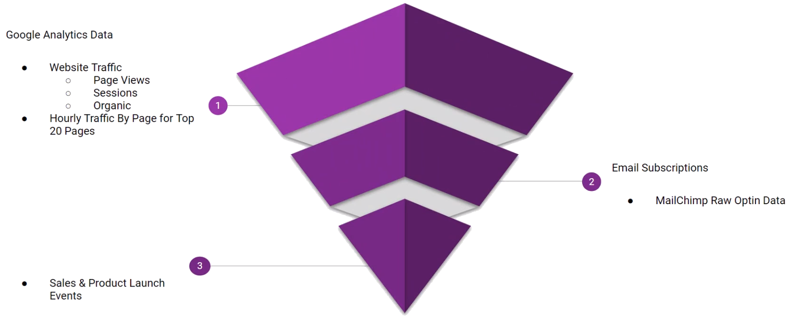

```{r setup, include=FALSE}
knitr::opts_chunk$set(echo = TRUE)
```

<!-- # Goals: -->
<!-- # - Packages -->
<!-- # - Data -->


## Packages

```{r, include=FALSE}
source("utils.R")
source("packages.R")
library(DT)
```


### Data Wrangling & Viz

```{r, eval=FALSE}
library(tidyverse)    # Meta - dplyr, ggplot2, purrr, tidyr, stringr, forcats
library(lubridate)    # date and time
library(timetk)       # Time series data wrangling, visualization and preprocessing
library(DataExplorer) # Data Viz
library(fs)           # Work with files
```


### Time Series

```{r, eval=FALSE}
library(forecast)     # Auto ARIMA, ETS
library(prophet)      # FB Prophet
```


### Machine Learning

```{r, eval=FALSE}
library(glmnet)       # Elastic Net
library(earth)        # Mars Regression Splines
library(kernlab)      # Support Vector Machine
library(knn)          # K-Nearest Neighbors
library(randomForest) # Random Forest
library(ranger)       # Random Forest
library(xgboost)      # Boosted Trees
library(Cubist)       # Cubist Rule-Based Algorithm
library(rules)        # Rule-based models (required for Cubist)
```


### Modeling Frameworks

```{r, eval=FALSE}
library(tidymodels)         # Meta - workflows, parsnip, tune, dials, recipes, rsample, yardstick
library(modeltime)          # tidymodels time series extension
library(modeltime.resample) # tidymodels time series backtesting extension
library(modeltime.ensemble) # tidymodels time series ensembling extension
library(modeltime.h2o)      # tidymodels time series auto-ml with h2o extension
```


### Deep Learning

```{r, eval=FALSE}
library(reticulate)         # Python interface
library(modeltime.gluonts)  # tidymodels interface to Amazon's deep learning algos
```


## Data

A company decided to change the selling process of its products converting from
a completely physical store approach, to a more digital and modern solution. 
Hence, it decided to open an online web store that integrates an e-commerce 
platform, where its "virtual" customers can by all the merchandise.  
In order to monitor this new business solution, it adopted few well-known data
analytics tools.  

&nbsp;  



&nbsp;  

Google Analytics has been set up on the web store pages to collect data related
to page views, sessions and organic searches. This could potentially help the 
company to understand whether its website is gaining popularity.  

Moreover, MailChimp is used to track all the customers that buy a product and
subscribe to the web store. 

Finally, marketing events like discount programs and new product launch are 
promoted through several social network channels.  

All these data are stored into the company database and can be used to analyze
the factors that impacts on the web store sales.  


### Google Analytics

Website hourly data related to Page Views, Sessions and Organic Traffic
of top 20 pages.   

```{r, echo=FALSE}
analytics_tbl <- read_rds("../data/analytics_hourly.rds")
analytics_tbl %>% dplyr::slice(1:50) %>% DT::datatable()
```


### Users

Mailchimp dataset of email subscriptions.  

```{r, echo=FALSE}
subscribers_tbl <- read_rds("../data/subscribers.rds")
subscribers_tbl %>% dplyr::slice(1:50) %>% DT::datatable()
```


### Events

Sales and Product launch events dataset.  

```{r, echo=FALSE}
events_tbl <- read_rds("../data/events.rds")
events_tbl %>% DT::datatable()
```


